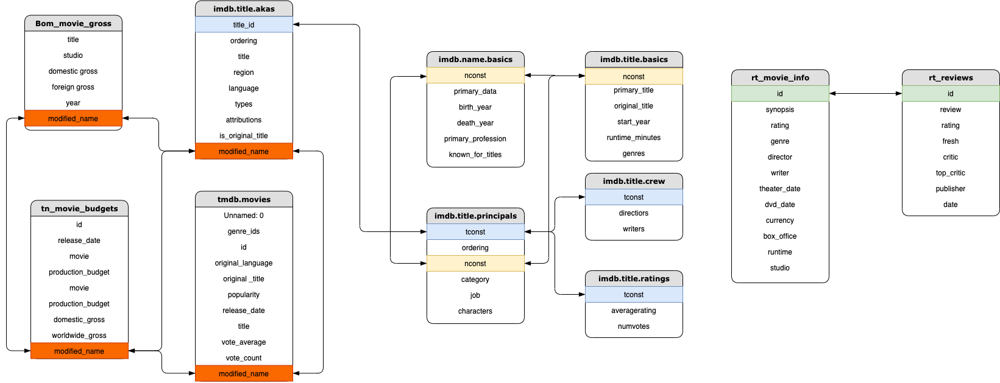
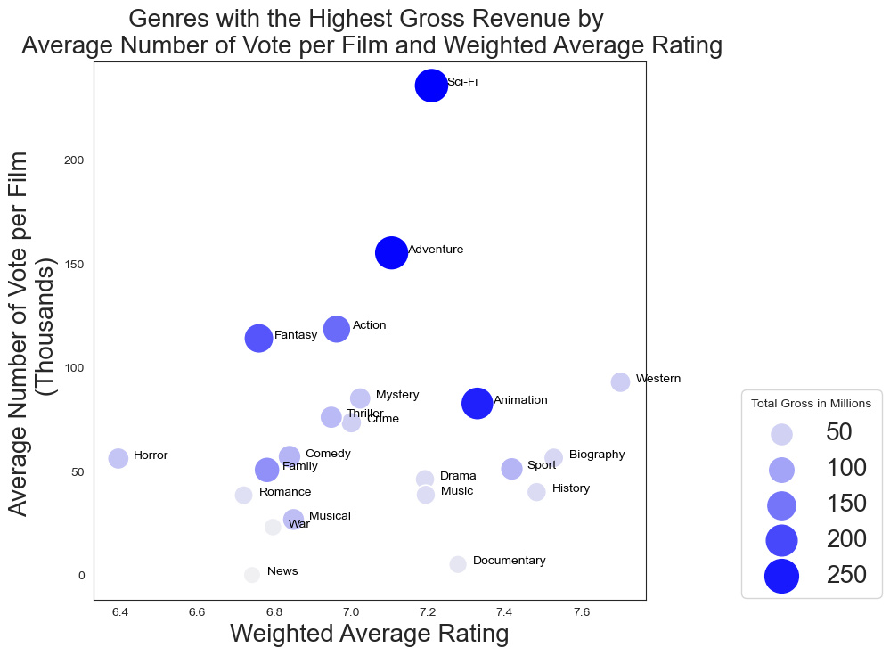
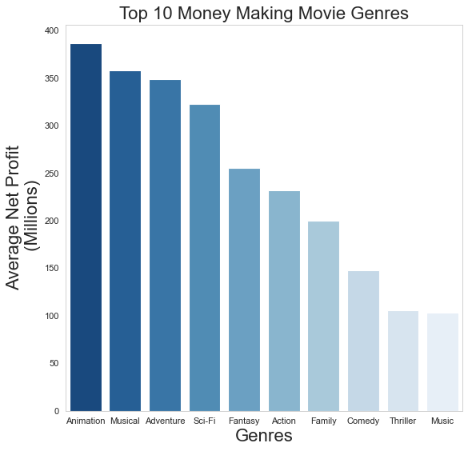
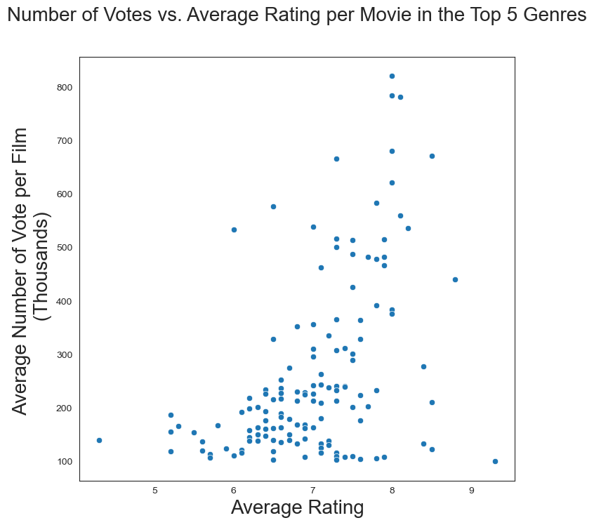
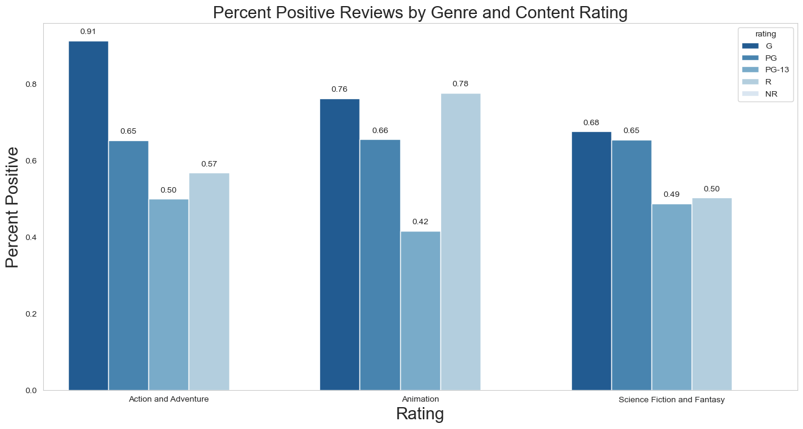

# Project Hollywood
>This repository is our analysis on several movie databases to find trends within and to propose recommendations to Microsoft who wants to enter the movie making industry. This repo will give an explination on the assumptions and analysis that was done to reach our final conclusions and recommendations.
>
>
## Table of Contents
* [General Info](#general-information)
* [Database](#database)
* [Analysis](#analysis)
* [Programming Language and other tools](#programming-language-and-other-tools)
* [Features](#features)
* [Project_Structure](#project-structure)

## General Information
- Exploring data from Box Office Mojo, IMDb, Rotten Tomatoes, The Numbers DB to extrapolate actionable insights on the types of genres that are doing the best at the box office.
- The theoretical client has created a new studio and wants to develop original video content. <br>
- In order for the client to successfully compete with its competitors, the client tasked our team to determine three recommendations on what type of films they should create.

## Database

Schemas of the data analyzed


The IMDb schemas were connected by tconst and nconst. While the other data were connected by title, to avoid any conflits with the title names our team decided to create a new index which removed all spaces and punctuation as well as making all text the same to ensure that no values are missing.


## Analysis
Two seperate analysis was done to confirm which genres were the best. The first analysis compared the IMDb database with the BOM database to see which genres were the most popular based upon the number of of votes. We made an assumption that all people have the same probabilty to vote online in a given database which means that the more vote is present, the more popular a specific movie genre  will be.
  
  

With that in mind, the IMDb data were merged all initially analyzed for the popularity and the BOM database was added later to provides the overall gross for each film genre. Just from these two database, we found that certain genres were far more popular than others and at the same time, managed to pull in more revenue.

To doublecheck this result and to incorporate the production budget, a seperate analysis of the IMDb database was compared to the TN database. This data came to a similar conclusion where the most popular were action, adventure, sci-fi, fantasy, and animation. As a group we devided that animation is not a standalone genre and suggest the other 4 as the focus which can be seen in the figure below.



One thing to note here is that a movie with a musical genre is shown as one of the highest returns, there were very few points of the data that had this information so we decided it would not be a good recommendation, however due to the high return it cannot simply be ignored.

With a clear set of genres in mind, a backbone to any good movie is having a good director leading the charge. By confirming the genres with two seperate database. If we assume that a popular movie will be able to make the best return, we can find the most popular movie and figure out who the best directors are.

i
  
In the figure ablove, the top movies are Advengers:Endgame , Mad Max: Fury Road, and Deadpool where the directors are the Russo Brothers, George Miller, Tim Miller respectively.
    
Wth a good diretor supporting the movie production, we also need to figure out who our target audience will be. Taking a look at the Rotten Tomatoes database and our primary genres of focus, we see that nearly all the primary categories have a good rating among the General audience (G). While the total numbers of reviews in the G category is lower in most cases, we can also assume that there are far fewer kids who would be writing reviews online for these movies. Also with a general rating, this rating is suitable for more people thus increase the chances of more views and be more profitable.




## Programming Language and other tools
- Python 
- Jupyter notebook, Pycharm
- draw.io

## Features
- Top movie geres based on user ratings
- Top movie geres based on domestic and foreign gross
- Top directors based on movie genres
- Show the most profitable genres
- Show the best motion picture content rating for each of the recommended genres
- module set up for quick and clean processing through code

## Team
- Mia Fryer <br>
    Github: miazfryer<br>
- Ian Sharff <br>
    Github: iansharff<br>
- Arthur Kim <br>
    Github: arthurk2323<br>
- Eddie Lin <br>
    Github: RedDragonfruit<br>

## Project Structure
```
├── README.md                           <- The top-level README for reviewers of this project
├── dsc-phase1-project-template.ipynb   <- Narrative documentation of analysis in Jupyter notebook
├── DS_Project_Presentation.pdf         <- PDF version of project presentation
├── data                                <- Both sourced externally and generated from code
└── images                              <- Both sourced externally and generated from code
```

