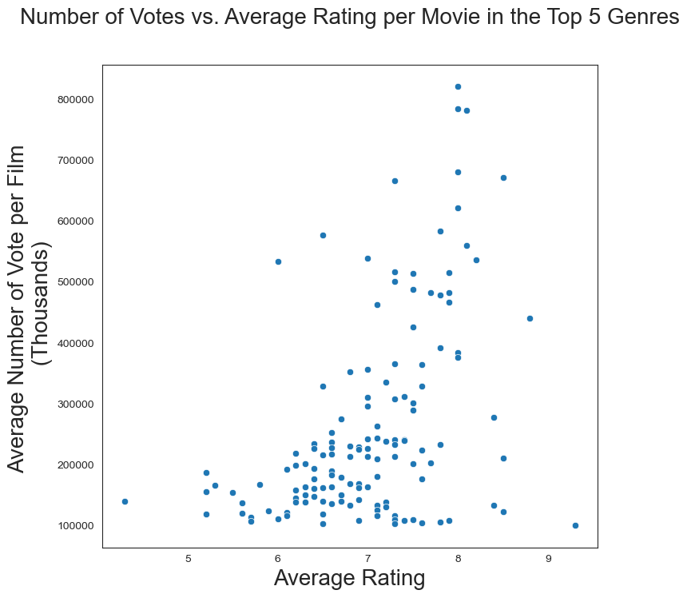

# Project Hollywood
>This repository is our first project using data to extrapolate actionable insights on the movie industry by using our combined knowledge to clean and manipulate data from a given set of data. This data will use all but one (tmdb) of the data sets provided to give a detailed insight on what the best option for a company trying to enter the movie industry. This repo will give an explination on how each dataset was cleaned to provide the final recommendations along with graphs for better undestanding.

## Table of Contents
* [General Info](#general-information)
* [Technologies Used](#technologies-used)
* [Features](#features)
* [Screenshots](#screenshots)

## General Information
- Exploring data from Box Office Mojo, IMDB, Rotten Tomatoes, The Numbers DB to extrapolate actionable insights on the types of genres that are doing the best at the box office.
- The client wants to develop original video content and recently established a movie studio
-In order for the client to successfully compete with its competitors, the client tasked Team   3 to determine three recommendations for the client to determine what type of films to create

## Technologies Used
- Python 
- Jupyter notebook
- draw.io
- 
## Features
- Top movie geres based on user ratings.
- Top movie geres based on domestic and foreign gross. 
- Top directors based on movie genres. 
- Show the most profitable genres.
- Show the best motion picture content rating for each of the recommended genres.

## Screenshots

