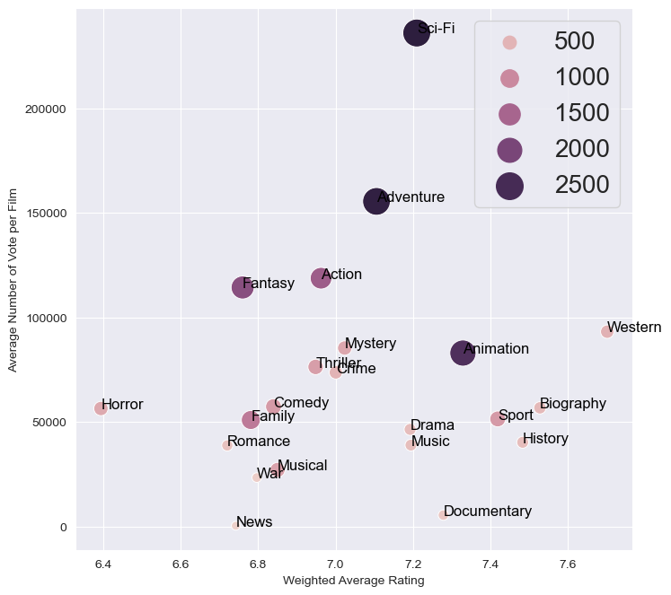

# Project Hollywood
>First coding project using data to extrapolate actionable insights on the movie industry.
>Practical expereince on how to clean and manipulate real world data.

## Table of Contents
* [General Info](#general-information)
* [Technologies Used](#technologies-used)
* [Features](#features)
* [Screenshots](#screenshots)

## General Information
- Exploring data from Box Office Mojo, IMDB, Rotten Tomatoes, The Movie DB to extrapolate   actionable insights on the types of films that are doing the best at the box office.
- The client wants to develop original video content and recently established a movie studio
-In order for the client to successfully compete with its competitors, the client tasked Team   3 to determine three recommendations for the client to determine what type of films to create

## Technologies Used
- Python 
- Jupyter notebook

## Features
- Top movie geres based on ratings 
- Top movie geres based on domestic and foreign gross 
- Top movie geres based on production crews 

## Screenshots

